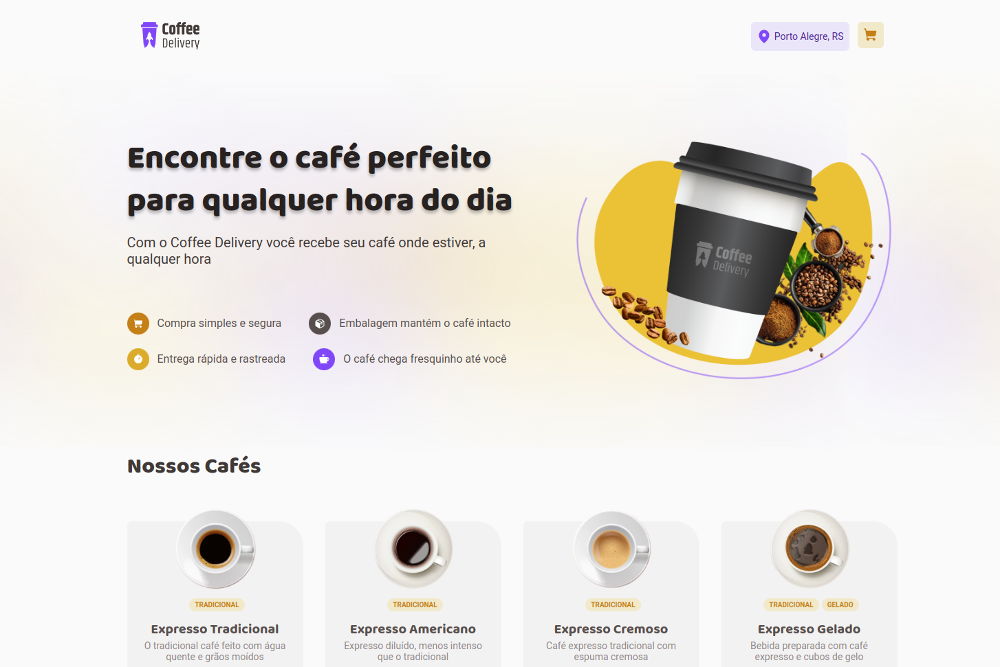

<h1 align="center">
  
</h1>

<span align="center">
  
</span>

## 💻 Project

This project is an application to manage a shopping cart of a fictional coffee shop that has the functionalities of listing products, adding items to the cart, increasing and removing items, displaying the total number of items in the cart and the total value of the sum of items. 

</br>
</br>

## ⚙ Technologies
This project was developed with the following technologies:

- [Vite](https://vitejs.dev)
- [ReactJS](https://reactjs.org)
- [TypeScript](https://www.typescriptlang.org/)
- [Styled Components](https://styled-components.com)

## 👷 How to run 🚀

Install the dependencies of each project:
```bash
# Install the dependencies
$ npm i
# Start the project
$ npm run dev
```

## 🔖 Layout

- [Figma](https://www.figma.com/file/yovgMr2YPl1OkF4i60qdxG/Coffee-Delivery-(Copy)?t=4Sir9AZljCKH5KFB-0)

## 📝 License

- [LICENSE](License.md).
